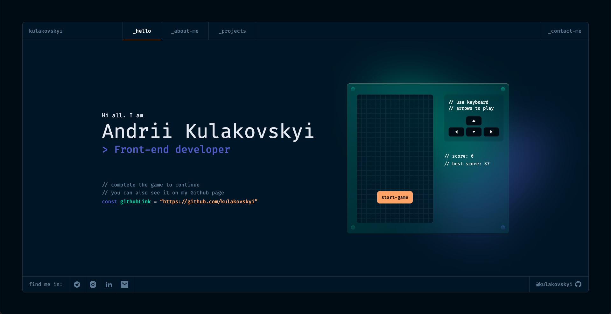
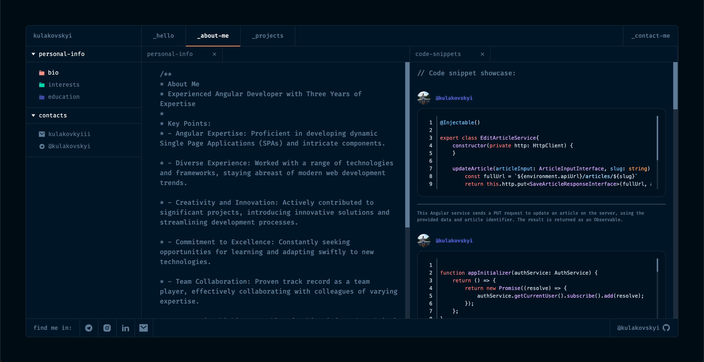
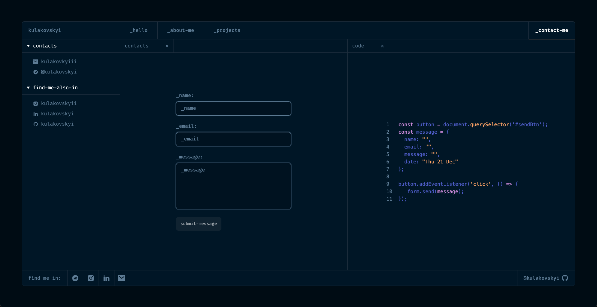
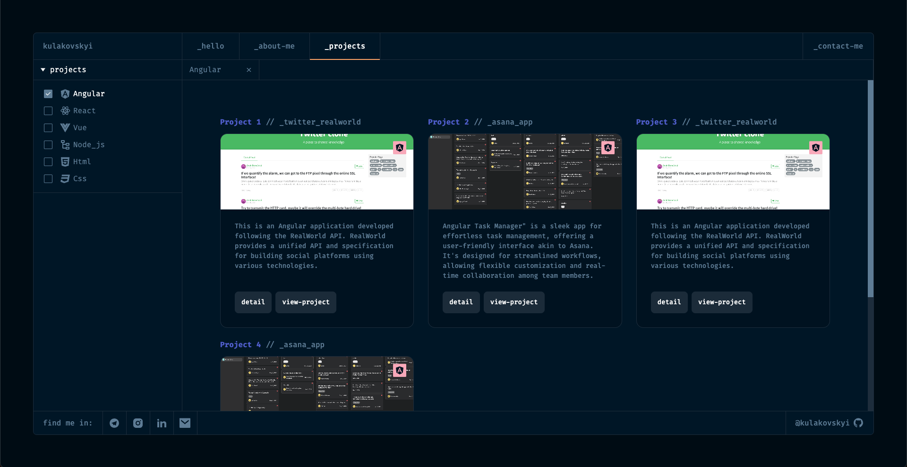

# Portfolio layout Angular 16

## Description

Welcome to the Angular Portfolio App repository! This project is a dynamic portfolio website built with Angular, showcasing various features such as integration with Firebase for data storage, animations using Angular's built-in animation capabilities, a simple Snake game on the start screen, GitHub code snippet display, and a contact form with reactive forms for email submissions.

## Technologies Used
- **Angular**: The project is developed using the Angular framework.
- **RxJS**: The RxJS library is used for reactive programming.
- **Firebase**: Data is fetched from and stored on Firebase for a seamless backend experience.

## Features
- **Animations**: The application utilizes Angular's built-in animation features to enhance the user experience.
- **Snake Game**: Enjoy a mini Snake game on the start screen for some added fun.
- **GitHub Code Snippets**: The app features a service that fetches and displays active code snippets from GitHub.
- **Contact Form**: A contact form is implemented using reactive forms for efficient handling of user input.
- **Email Submission**: Users can submit messages via the contact form, with email submissions facilitated through reactive forms.

## Cross-Browser Compatibility
The application is designed to work seamlessly across all resolutions and is fully compatible with various web browsers.

## Installation

1. Clone the repository:
   git clone https://github.com/kulakovskyi/angular-portfolio-layout.git

2. Install dependencies:
   npm install

3. Run the application:
   ng serve

## Demo

Explore the live version of the application [HERE](https://portfolio-angular-layout.web.app/).

## Screenshots

## 🚨 Important: Forking this Repository (Please Read!)

Thank you for considering the use of this code for your own website. Many individuals have reached out to inquire about utilizing this code, and generally, the answer is yes, with proper attribution.

I highly value the openness of my site's source code, but it's crucial to address the issue of plagiarism. It's disheartening to discover instances where someone has copied my site without giving due credit. Building and designing this iteration of my website required a substantial amount of effort, and I take pride in it. All I ask is for users to refrain from claiming this effort as their own.

Feel free to fork and build upon this code, but please be respectful of the effort invested and provide proper attribution.

## Contribution

Your contributions are welcome! If you have suggestions to enhance the project or if you've encountered a bug, feel free to create an issue or submit a pull request.
